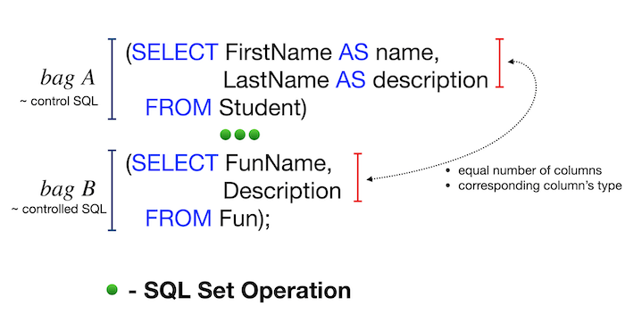

# Day 01

## _First steps working with sets and JOINs in SQL_

Resume: Today you will see how to get needed data based on sets constructions and simple JOINs.

## Contents

1. [Chapter I](#chapter-i) \
    1.1. [Preamble](#preamble)
2. [Chapter II](#chapter-iii) \
    2.1. [Rules of the day](#rules-of-the-day)  
3. [Chapter III](#chapter-iv) \
    3.1. [Exercise 00 - Let’s make UNION dance](#exercise-00-lets-make-union-dance)  
4. [Chapter V](#chapter-v) \
    4.1. [Exercise 01 - UNION dance with subquery](#exercise-01-union-dance-with-subquery)  
5. [Chapter VI](#chapter-vi) \
    5.1. [Exercise 02 - Duplicates or not duplicates](#exercise-02-duplicates-or-not-duplicates)  
6. [Chapter VII](#chapter-vii) \
    6.1. [Exercise 03 - “Hidden” Insights](#exercise-03-hidden-insights)  
7. [Chapter VIII](#chapter-viii) \
    7.1. [Exercise 04 - Difference? Yep, let's find the difference between multisets](#exercise-04-difference-yep-lets-find-the-difference-between-multisets)
8. [Chapter IX](#chapter-ix) \
    8.1. [Exercise 05 - Did you hear about Cartesian Product?](#exercise-05-did-you-hear-about-cartesian-product)
9. [Chapter X](#chapter-x) \
    9.1. [Exercise 06 - Lets see on “Hidden” Insights](#exercise-06-lets-see-on-hidden-insights)
10. [Chapter XI](#chapter-xi) \
    10.1. [Exercise 07 - Just make a JOIN](#exercise-07-just-make-a-join)
11. [Chapter XII](#chapter-xii) \
    11.1. [Exercise 08 - Migrate JOIN to NATURAL JOIN](#exercise-08-migrate-join-to-natural-join)
12. [Chapter XIII](#chapter-xiii) \
    12.1. [Exercise 09 - IN versus EXISTS](#exercise-09-in-versus-exists)
13. [Chapter XIV](#chapter-xiv) \
    13.1. [Exercise 10 - Global JOIN](#exercise-10-global-join)


## Chapter I
## Preamble


In many aspects, sets are used in Relational Databases. Not only to do UNION or MINUS between sets. Sets are also good candidates for doing recursive queries.

There are the following set operators in PostgreSQL:
- UNION [ALL]
- EXCEPT [ALL] 
- INTERSECT [ALL]

The keyword "ALL" means to store duplicate rows in the result.
The main rules for working with sets are as follows:
- Main SQL provides final names of attributes for the whole query.
- The attributes of controlled SQL should match the number of columns and corresponding family types of main SQL.



In addition, SQL sets are useful for calculating some specific data science metrics, such as the Jaccard distance between 2 objects based on existing data features.

## Chapter III
## Rules of the day

- Please make sure you have your own database and access to it on your PostgreSQL cluster. 
- Please download a [script](materials/model.sql) with Database Model here and apply the script to your database (you can use command line with psql or just run it through any IDE, for example DataGrip from JetBrains or pgAdmin from PostgreSQL community). 
- All tasks contain a list of Allowed and Denied sections with listed database options, database types, SQL constructions etc. Please have a look at the section before you start.
- Please take a look at the Logical View of our Database Model. 


1. **pizzeria** table (Dictionary Table with available pizzerias)
- field id - primary key
- field name - name of pizzeria
- field rating - average rating of pizzeria (from 0 to 5 points)
2. **person** table (Dictionary Table with persons who loves pizza)
- field id - primary key
- field name - name of person
- field age - age of person
- field gender - gender of person
- field address - address of person
3. **menu** table (Dictionary Table with available menu and price for concrete pizza)
- field id - primary key
- field pizzeria_id - foreign key to pizzeria
- field pizza_name - name of pizza in pizzeria
- field price - price of concrete pizza
4. **person_visits** table (Operational Table with information about visits of pizzeria)
- field id - primary key
- field person_id - foreign key to person
- field pizzeria_id - foreign key to pizzeria
- field visit_date - date (for example 2022-01-01) of person visit 
5. **person_order** table (Operational Table with information about persons orders)
- field id - primary key
- field person_id - foreign key to person
- field menu_id - foreign key to menu
- field order_date - date (for example 2022-01-01) of person order 

People's visit and people's order are different entities and don't contain any correlation between data. For example, a customer can be in a restaurant (just looking at the menu) and in that time place an order in another restaurant by phone or mobile application. Or another case, just be at home and again make a call with order without any visits.

## Chapter IV
## Exercise 00 - Let’s make UNION dance

| Exercise 00: Let’s make UNION dance |                                                                                                                          |
|---------------------------------------|--------------------------------------------------------------------------------------------------------------------------|
| Turn-in directory                     | ex00                                                                                                                     |
| Files to turn-in                      | `day01_ex00.sql`                                                                                 |
| **Allowed**                               |                                                                                                                          |
| Language                        | ANSI SQL                                                                                              |

Please write a SQL statement that returns the menu identifier and pizza names from the `menu` table and the person identifier and person name from the `person` table in one global list (with column names as shown in the example below) ordered by object_id and then by object_name columns.

| object_id | object_name |
| ------ | ------ |
| 1 | Anna |
| 1 | cheese pizza |
| ... | ... |

### Decision
```SQL
SELECT p.id AS object_id, p.name AS object_name
FROM person p
UNION
SELECT m.id AS object_id, m.pizza_name AS object_name
FROM menu m
ORDER BY object_id, object_name;
```

## Chapter V
## Exercise 01 - UNION dance with subquery

| Exercise 01: UNION dance with subquery|                                                                                                                          |
|---------------------------------------|--------------------------------------------------------------------------------------------------------------------------|
| Turn-in directory                     | ex01                                                                                                                     |
| Files to turn-in                      | `day01_ex01.sql`                                                                                 |
| **Allowed**                               |                                                                                                                          |
| Language                        | ANSI SQL                                                                                              |

Please modify an SQL statement from "Exercise 00" by removing the object_id column. Then change the order by object_name for part of the data from the `person` table and then from the `menu` table (as shown in an example below). Please save duplicates!

| object_name |
| ------ |
| Andrey |
| Anna |
| ... |
| cheese pizza |
| cheese pizza |
| ... |

### Decision
```SQL
(SELECT person.name AS object_name
    FROM person
 	ORDER BY name)
    UNION ALL 
(SELECT menu.pizza_name AS object_name
    FROM menu
    ORDER BY pizza_name)
```

## Chapter VI
## Exercise 02 - Duplicates or not duplicates

| Exercise 02: Duplicates or not duplicates|                                                                                                                          |
|---------------------------------------|--------------------------------------------------------------------------------------------------------------------------|
| Turn-in directory                     | ex02                                                                                                                     |
| Files to turn-in                      | `day01_ex02.sql`                                                                                 |
| **Allowed**                               |                                                                                                                          |
| Language                        | ANSI SQL                                                                                              |
| **Denied**                               |                                                                                                                          |
| SQL Syntax Construction                        | `DISTINCT`, `GROUP BY`, `HAVING`, any type of `JOINs`                                                                                              |
 
Write an SQL statement that returns unique pizza names from the `menu` table and sorts them by the pizza_name column in descending order. Please note the Denied section.

### Decision
```SQL
SELECT pizza_name
FROM menu
INTERSECT
SELECT pizza_name
FROM menu
ORDER BY pizza_name DESC;
```

## Chapter VII
## Exercise 03 - “Hidden” Insights

| Exercise 03: “Hidden” Insights |                                                                                                                          |
|---------------------------------------|--------------------------------------------------------------------------------------------------------------------------|
| Turn-in directory                     | ex03                                                                                                                     |
| Files to turn-in                      | `day01_ex03.sql`                                                                                 |
| **Allowed**                               |                                                                                                                          |
| Language                        | ANSI SQL                                                                                              |
| **Denied**                               |                                                                                                                          |
| SQL Syntax Construction                        |  any type of `JOINs`                                                                                              |

Write an SQL statement that returns common rows for attributes order_date, person_id from the `person_orders` table on one side and visit_date, person_id from the `person_visits` table on the other side (see an example below). In other words, let's find the identifiers of persons who visited and ordered a pizza on the same day. Actually, please add the order by action_date in ascending mode and then by person_id in descending mode.

| action_date | person_id |
| ------ | ------ |
| 2022-01-01 | 6 |
| 2022-01-01 | 2 |
| 2022-01-01 | 1 |
| 2022-01-03 | 7 |
| 2022-01-04 | 3 |
| ... | ... |


### Decision
```SQL
(SELECT p.order_date AS action_date, p.person_id AS person_id
    FROM person_order p
 	ORDER BY action_date ASC, person_id DESC)
    UNION ALL
(SELECT p.visit_date AS action_date, p.person_id AS person_id
    FROM person_visits p
    ORDER BY action_date ASC,person_id DESC)
```

## Chapter VIII
## Exercise 04 - Difference? Yep, let's find the difference between multisets.


| Exercise 04: Difference? Yep, let's find the difference between multisets. |                                                                                                                          |
|---------------------------------------|--------------------------------------------------------------------------------------------------------------------------|
| Turn-in directory                     | ex04                                                                                                                     |
| Files to turn-in                      | `day01_ex04.sql`                                                                                 |
| **Allowed**                               |                                                                                                                          |
| Language                        | ANSI SQL                                                                                              |
| **Denied**                               |                                                                                                                          |
| SQL Syntax Construction                        |  any type of `JOINs`                                                                                              |

Please write a SQL statement that returns a difference (minus) of person_id column values while saving duplicates between `person_order` table and `person_visits` table for order_date and visit_date are for January 7, 2022.

### Decision
```SQL
SELECT person_id
FROM person_order
WHERE order_date = '2022-01-07'
EXCEPT ALL
SELECT person_id 
FROM  person_visits 
WHERE visit_date = '2022-01-07';
```

## Chapter IX
## Exercise 05 - Did you hear about Cartesian Product?


| Exercise 05: Did you hear about Cartesian Product? |                                                                                                                          |
|---------------------------------------|--------------------------------------------------------------------------------------------------------------------------|
| Turn-in directory                     | ex05                                                                                                                     |
| Files to turn-in                      | `day01_ex05.sql`                                                                                 |
| **Allowed**                               |                                                                                                                          |
| Language                        | ANSI SQL                                                                                              |

Please write a SQL statement that returns all possible combinations between `person` and `pizzeria` tables, and please set the order of the person identifier columns and then the pizzeria identifier columns. Please take a look at the sample result below. Please note that the column names may be different for you.

| person.id | person.name | age | gender | address | pizzeria.id | pizzeria.name | rating |
| ------ | ------ | ------ | ------ | ------ | ------ | ------ | ------ |
| 1 | Anna | 16 | female | Moscow | 1 | Pizza Hut | 4.6 |
| 1 | Anna | 16 | female | Moscow | 2 | Dominos | 4.3 |
| ... | ... | ... | ... | ... | ... | ... | ... |

### Decision
```SQL
SELECT DISTINCT person.id, person.name AS person_name, person.age, person.gender, person.address,
       pizzeria.id AS pizzeria_id, pizzeria.name AS pizzeria_name, pizzeria.rating
FROM person, pizzeria;
```

## Chapter X
## Exercise 06 - Lets see on “Hidden” Insights


| Exercise 06: Lets see on “Hidden” Insights |                                                                                                                          |
|---------------------------------------|--------------------------------------------------------------------------------------------------------------------------|
| Turn-in directory                     | ex06                                                                                                                     |
| Files to turn-in                      | `day01_ex06.sql`                                                                                 |
| **Allowed**                               |                                                                                                                          |
| Language                        | ANSI SQL                                                                                              |

Let's go back to Exercise #03 and modify our SQL statement to return person names instead of person identifiers and change the order by action_date in ascending mode and then by person_name in descending mode. Take a look at the sample data below.

| action_date | person_name |
| ------ | ------ |
| 2022-01-01 | Irina |
| 2022-01-01 | Anna |
| 2022-01-01 | Andrey |
| ... | ... |

### Decision
```SQL
(SELECT p.order_date AS action_date, name AS person_name
    FROM person_order p, person)
    UNION ALL
(SELECT p.visit_date AS action_date, name AS person_name
    FROM person_visits p, person
    ORDER BY action_date ASC, person_name DESC)
```


## Chapter XI
## Exercise 07 - Just make a JOIN


| Exercise 07: Just make a JOIN |                                                                                                                          |
|---------------------------------------|--------------------------------------------------------------------------------------------------------------------------|
| Turn-in directory                     | ex07                                                                                                                     |
| Files to turn-in                      | `day01_ex07.sql`                                                                                 |
| **Allowed**                               |                                                                                                                          |
| Language                        | ANSI SQL                                                                                              |

Write an SQL statement that returns the order date from the `person_order` table and the corresponding person name (name and age are formatted as in the data sample below) who made an order from the `person` table. Add a sort by both columns in ascending order.

| order_date | person_information |
| ------ | ------ |
| 2022-01-01 | Andrey (age:21) |
| 2022-01-01 | Andrey (age:21) |
| 2022-01-01 | Anna (age:16) |
| ... | ... |

### Decision
```SQL
SELECT order_date, CONCAT(person.name ,'(age:', person.age,')') AS person_information
FROM person_order
JOIN person ON person_order.person_id = person.id 
ORDER BY order_date, person_information;
```

## Chapter XII
## Exercise 08 - Migrate JOIN to NATURAL JOIN


| Exercise 08: Migrate JOIN to NATURAL JOIN |                                                                                                                          |
|---------------------------------------|--------------------------------------------------------------------------------------------------------------------------|
| Turn-in directory                     | ex08                                                                                                                     |
| Files to turn-in                      | `day01_ex08.sql`                                                                                 |
| **Allowed**                               |                                                                                                                          |
| Language                        | ANSI SQL                                                                                              |
| SQL Syntax Construction                        | `NATURAL JOIN`                                                                                              |
| **Denied**                               |                                                                                                                          |
| SQL Syntax Construction                        | other type of  `JOINs`                                                                                              |

Please rewrite a SQL statement from Exercise #07 by using NATURAL JOIN construction. The result must be the same like for Exercise #07.  

### Decision
```SQL
SELECT order_date, CONCAT(from_inf.name ,'(age:', from_inf.age,')')
	AS person_information
FROM person_order
NATURAL JOIN (SELECT id AS person_id ,name ,age FROM person) AS from_inf
ORDER BY order_date, person_information;
```

## Chapter XIII
## Exercise 09 - IN versus EXISTS


| Exercise 09: IN versus EXISTS |                                                                                                                          |
|---------------------------------------|--------------------------------------------------------------------------------------------------------------------------|
| Turn-in directory                     | ex09                                                                                                                     |
| Files to turn-in                      | `day01_ex09.sql`                                                                                 |
| **Allowed**                               |                                                                                                                          |
| Language                        | ANSI SQL                                                                                              |

Write 2 SQL statements that return a list of pizzerias that have not been visited by people using IN for the first and EXISTS for the second.

### Decision
```SQL
SELECT name
FROM pizzeria
WHERE id NOT IN (SELECT pizzeria_id FROM person_visits);

SELECT name
FROM pizzeria
WHERE NOT EXISTS(SELECT pizzeria_id FROM person_visits WHERE pizzeria_id = pizzeria.id);
```

## Chapter XIV
## Exercise 10 - Global JOIN


| Exercise 10: Global JOIN |                                                                                                                          |
|---------------------------------------|--------------------------------------------------------------------------------------------------------------------------|
| Turn-in directory                     | ex10                                                                                                                     |
| Files to turn-in                      | `day01_ex10.sql`                                                                                 |
| **Allowed**                               |                                                                                                                          |
| Language                        | ANSI SQL                                                                                              |

Please write an SQL statement that returns a list of the names of the people who ordered pizza from the corresponding pizzeria. 
The sample result (with named columns) is provided below and yes ... please make the ordering by 3 columns (`person_name`, `pizza_name`, `pizzeria_name`) in ascending mode.

| person_name | pizza_name | pizzeria_name | 
| ------ | ------ | ------ |
| Andrey | cheese pizza | Dominos |
| Andrey | mushroom pizza | Dominos |
| Anna | cheese pizza | Pizza Hut |
| ... | ... | ... |

### Decision
```SQL
SELECT  pr.name AS person_name, m.pizza_name AS pizza_name, p.name AS name 
FROM person_order AS po
JOIN person pr ON po.person_id = pr.id
JOIN menu m ON m.id = po.menu_id
JOIN pizzeria p ON m.pizzeria_id = p.id
ORDER BY person_name;
```
